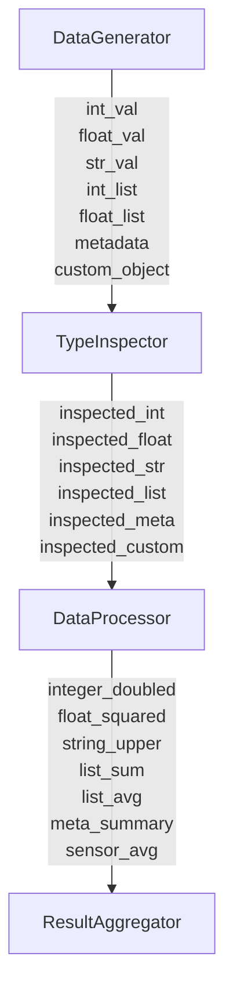
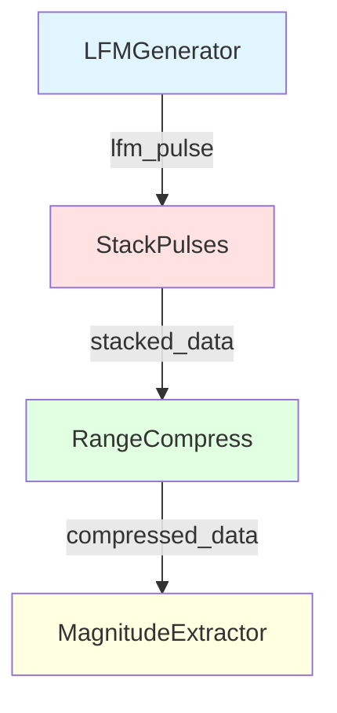
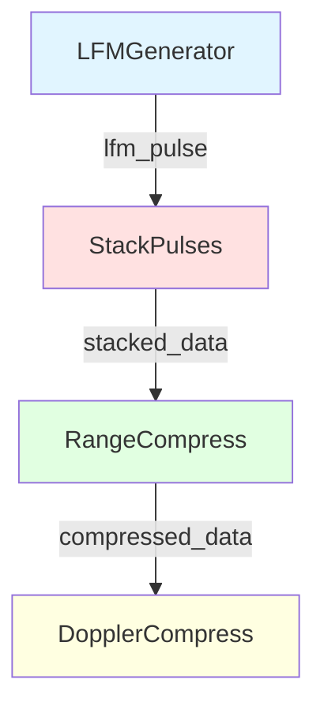

# GraphData API: Complete Examples and Visualizations

This document provides comprehensive examples and visualizations for the GraphData API in graph-sp.

## Table of Contents

1. [Understanding GraphData](#understanding-graphdata)
2. [Multiple Data Types Demo](#multiple-data-types-demo)
3. [Radar Processing Demo](#radar-processing-demo)
4. [Architecture and Flexibility](#architecture-and-flexibility)

---

## Understanding GraphData

### What is GraphData?

**GraphData is a transport container, NOT a type restriction!**

The key insight: GraphData provides a structured way to pass data between nodes, but it doesn't restrict what you can pass. Your node functions can work with ANY data type they want.

```rust
// GraphData is just an enum wrapper
pub enum GraphData {
    Int(i64),
    Float(f64),
    String(String),
    FloatVec(Vec<f64>),
    IntVec(Vec<i64>),
    Map(HashMap<String, GraphData>),  // For nested/arbitrary data!
    None,
    // Optional radar types (behind feature flag)
    Complex(Complex<f64>),
    FloatArray(Array1<f64>),
    ComplexArray(Array1<Complex<f64>>),
}
```

### Why Map Makes It Universal

The `Map` variant is the key to supporting **any data type**:
- Serialize custom structs → Map
- Nest Maps inside Maps → arbitrary depth
- Store arrays as Maps with numeric keys
- Your node functions decide the structure

**You're not limited to the enum variants.** You can pass ANY serializable data through Map!

---

## Multiple Data Types Demo

### Purpose

Demonstrates that GraphData handles:
- Basic types (int, float, string)
- Collections (lists/vectors)
- Nested structures (dicts/maps)
- Custom objects (via Map serialization)
- Complex numbers (as tuples in Python)

### Pipeline Architecture



### Node Descriptions

1. **DataGenerator**: Creates diverse data types
   - Integers: `42`
   - Floats: `3.14159`
   - Strings: `"Hello, GraphData!"`
   - Lists: `[1, 2, 3, 4, 5]`
   - Nested Maps: Metadata with configuration
   - Custom Objects: Sensor readings with calibration data

2. **TypeInspector**: Analyzes and reports types
   - Inspects each data type received
   - Shows type information
   - Passes data through unchanged

3. **DataProcessor**: Performs type-specific operations
   - Doubles integers
   - Squares floats
   - Uppercases strings
   - Calculates list statistics
   - Processes nested structures
   - Analyzes sensor data

4. **ResultAggregator**: Summarizes results
   - Counts result types
   - Creates summary statistics
   - Reports success

### Running the Examples

**Rust:**
```bash
cargo run --example data_types_demo
```

**Python:**
```bash
python examples/python_data_types_demo.py
```

### Example Output

```
DataGenerator: Creating diverse data types
TypeInspector: Analyzing received data types

integer:
  Type: Int, Value: 42

float:
  Type: Float, Value: 3.14159

metadata:
  Type: Map, Keys: 4
    - version
    - config
    - timestamp
    - author

DataProcessor: Processing multiple data types
Integer: 42 → doubled → 84
Float: 3.14159 → squared → 9.86959
String: 'Hello, GraphData!' → upper → 'HELLO, GRAPHDATA!'
Float List: [1.1, 2.2, 3.3, 4.4, 5.5]
  Sum: 16.50, Average: 3.30
Metadata: Version 1.0.0 by graph-sp
Sensor SENSOR_001: Average reading = 23.80

ResultAggregator: Creating final summary
Summary:
  Total outputs: 7
  Numeric results: 5
  String results: 2
```

---

## Radar Processing Demo

### Purpose

Demonstrates real-world signal processing with complex data:
- LFM (Linear Frequency Modulation) pulse generation
- Pulse stacking for pulse-Doppler radar
- Range compression via FFT
- Doppler compression (Python only)
- Peak detection

### Rust Pipeline Architecture



**DAG Statistics:**
- Nodes: 4
- Depth: 4 levels
- Max Parallelism: 1 (sequential pipeline)

### Python Pipeline Architecture



**DAG Statistics:**
- Nodes: 4
- Depth: 4 levels
- Includes both Range AND Doppler compression

### Node Descriptions

1. **LFMGenerator**: Generates linear frequency modulation pulse
   - Creates chirp signal: frequency increases linearly with time
   - Output: Complex array (256 samples in Rust, 256 in Python)
   - Uses: `ndarray` (Rust) or `numpy` (Python)

2. **StackPulses**: Stacks multiple pulses for pulse-Doppler processing
   - Rust: 4 pulses (1024 samples total)
   - Python: 16 pulses with Doppler shifts (4096 samples)
   - Simulates multiple radar transmission cycles

3. **RangeCompress**: Performs FFT for range compression
   - Converts time-domain to frequency-domain
   - Reveals target range information
   - Uses: `rustfft` (Rust) or `numpy.fft` (Python)

4. **DopplerCompress** (Python only): Performs FFT along slow-time
   - Reveals target velocity (Doppler) information
   - Creates Range-Doppler map
   - Output: 2D array showing targets in range and Doppler

5. **MagnitudeExtractor** (Rust only): Extracts magnitude and finds peaks
   - Computes magnitude from complex data
   - Identifies peak location
   - Reports detection results

### Running the Examples

**Rust:**
```bash
cargo run --example radar_demo --features radar_examples
```

**Python:**
```bash
python examples/python_radar_demo.py
```

### Example Output

**Rust:**
```
LFMGenerator: Generated 256 sample LFM pulse
StackPulses: Stacked 4 pulses of 256 samples each
RangeCompress: Performed FFT on 1024 samples
MagnitudeExtractor: Peak magnitude 101.61 at index 828
```

**Python:**
```
LFMGenerator: Generated 256 sample LFM pulse
StackPulses: Stacked 16 pulses of 256 samples each
RangeCompress: Performed FFT on (16, 256) data
DopplerCompress: Created Range-Doppler map of shape (16, 256)
DopplerCompress: Peak at Doppler bin 2, Range bin 207
DopplerCompress: Peak magnitude: 307.93
```

### Signal Processing Concepts

**LFM (Linear Frequency Modulation):**
- Chirp signal where frequency increases linearly
- Formula: `s(t) = exp(j * 2π * (chirp_rate/2) * t²)`
- Used in radar for range resolution

**Range Compression:**
- FFT converts time-domain signal to frequency-domain
- Compresses pulse energy to a single range bin
- Improves target detection

**Doppler Compression:**
- FFT along slow-time (pulse dimension)
- Reveals target velocity from phase changes
- Creates Range-Doppler map for target detection

**Range-Doppler Map:**
- 2D representation: Range (horizontal) × Doppler (vertical)
- Bright spots indicate targets
- Position reveals target range and velocity

---

## Architecture and Flexibility

### Question: Can GraphData Support Arbitrary Data Types?

**Answer: YES!** Here's why:

#### 1. The Graph Executor Doesn't Care About Data Types

The graph executor's job is to:
- Manage execution order (topological sort)
- Pass data between nodes
- Handle parallelization

It doesn't need to know what's in the data!

```rust
// Graph executor just calls node functions
let outputs = node.function(&inputs, &variant_params);
context.extend(outputs);
```

#### 2. GraphData::Map Enables Arbitrary Data

The `Map` variant can hold ANY structure:

```python
# Python: Pass a custom class as a dict
class SensorReading:
    def __init__(self, temp, pressure, humidity):
        self.temp = temp
        self.pressure = pressure
        self.humidity = humidity
    
    def to_dict(self):
        return {
            "temp": self.temp,
            "pressure": self.pressure,
            "humidity": self.humidity
        }

# In your node function:
def process_sensor(inputs, params):
    reading = inputs["sensor_data"]  # Comes through as a dict (Map)
    # Process however you want!
    return {"processed": reading["temp"] * 1.8 + 32}
```

```rust
// Rust: Serialize custom structs to Map
#[derive(Debug)]
struct SensorReading {
    temp: f64,
    pressure: f64,
    humidity: f64,
}

impl SensorReading {
    fn to_graph_data(&self) -> GraphData {
        let mut map = HashMap::new();
        map.insert("temp".to_string(), GraphData::float(self.temp));
        map.insert("pressure".to_string(), GraphData::float(self.pressure));
        map.insert("humidity".to_string(), GraphData::float(self.humidity));
        GraphData::map(map)
    }
    
    fn from_graph_data(data: &GraphData) -> Option<Self> {
        if let GraphData::Map(m) = data {
            Some(SensorReading {
                temp: m.get("temp")?.as_float()?,
                pressure: m.get("pressure")?.as_float()?,
                humidity: m.get("humidity")?.as_float()?,
            })
        } else {
            None
        }
    }
}
```

#### 3. Zero-Copy for Performance-Critical Data

For large arrays or performance-critical paths:
- **Rust**: Use `Arc<T>` or references within Map
- **Python**: NumPy arrays pass through efficiently
- The Map variant can hold references, not just owned data

#### 4. Type Safety Where You Need It

You control type safety at the node level:

```rust
// Strict typing in node function
fn strict_processor(
    inputs: &HashMap<String, GraphData>,
    _params: &HashMap<String, GraphData>
) -> HashMap<String, GraphData> {
    // Enforce type at node level
    let temp = inputs.get("temperature")
        .and_then(|d| d.as_float())
        .expect("temperature must be a float");
    
    // Process with type safety
    let mut outputs = HashMap::new();
    outputs.insert("celsius".to_string(), GraphData::float(temp));
    outputs.insert("fahrenheit".to_string(), GraphData::float(temp * 1.8 + 32.0));
    outputs
}
```

### Why Not Add Every Type to the Enum?

**We don't need to!** The current design is intentionally minimal:

1. **Core types** (Int, Float, String, Vecs): Cover 90% of use cases
2. **Map**: Handles everything else through composition
3. **Optional features** (Complex, Arrays): Behind feature flags for specialized domains

Adding more specific types would:
- ❌ Bloat the enum
- ❌ Increase compilation times
- ❌ Add maintenance burden
- ❌ Still never cover every possible type

Instead, **Map gives you infinite flexibility** while keeping the core simple.

### Design Philosophy

```
GraphData = Transport Container + Composition Pattern

Transport Container:
  - Moves data between nodes
  - Doesn't restrict content
  - Minimal overhead

Composition Pattern:
  - Map enables arbitrary nesting
  - Your code defines structure
  - Type safety where you need it
```

---

## Summary

### Key Insights

1. **GraphData is a container, not a restriction**
   - The graph executor doesn't care about data types
   - Your node functions control what data means

2. **Map enables arbitrary types**
   - Serialize any struct → Map
   - Nest Maps → arbitrary depth
   - You're not limited to enum variants

3. **Keep demos in examples/**
   - Radar-specific code stays in `examples/radar_demo.rs` and `python_radar_demo.py`
   - Core library (`src/`) has minimal, general-purpose types
   - Feature flags (`radar_examples`) for specialized domains

4. **Comprehensive examples provided**
   - `data_types_demo`: Shows all supported types
   - `radar_demo`: Real-world signal processing
   - Both Rust and Python versions
   - Mermaid diagrams for visualization

### Next Steps

Want to use GraphData in your project?

1. **Basic types**: Just use Int, Float, String, Vecs directly
2. **Complex data**: Serialize to Map
3. **Performance-critical**: Use optional feature flags for specialized types
4. **Custom needs**: Extend GraphData with your own feature flag

The architecture supports any data type you need!
