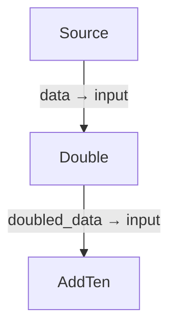
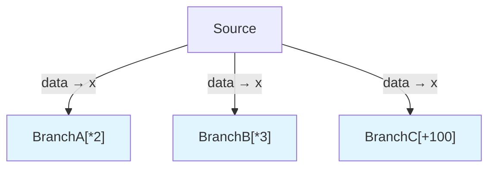
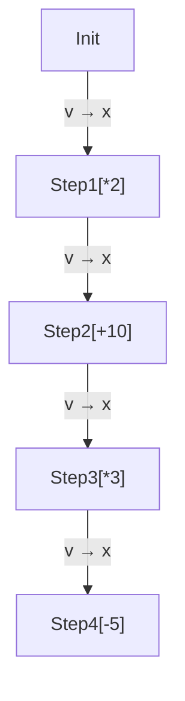

# Python Examples - Execution Output

This document shows actual execution output from the Python demos.

## Python Comprehensive Demo

```bash
$ python examples/python_comprehensive_demo.py
```

**Output:**
```
======================================================================
Python Comprehensive Demo - graph-sp
======================================================================

──────────────────────────────────────────────────────────────────────
Demo 1: Basic Sequential Pipeline
──────────────────────────────────────────────────────────────────────

📊 Executing sequential pipeline...
✅ Execution completed in 0.02ms
📤 Final result: 210
   Expected: 210 (100 * 2 + 10)

📈 Mermaid Diagram:
graph TD
    0["Source"]
    1["Double"]
    2["AddTen"]
    0 -->|data → input| 1
    1 -->|doubled_data → input| 2


──────────────────────────────────────────────────────────────────────
Demo 2: Parallel Branching (Fan-Out)
──────────────────────────────────────────────────────────────────────

📊 Executing parallel branches...
   Each branch simulates 100ms of work

✅ Execution completed in 300.34ms
📤 Branch A result (50*2): 100
📤 Branch B result (50*3): 150
📤 Branch C result (50+100): 150
⚠️  Sequential execution detected (took 300.34ms)

📈 Mermaid Diagram:
graph TD
    0["Source"]
    1["BranchA[*2]"]
    2["BranchB[*3]"]
    3["BranchC[+100]"]
    0 -->|data → x| 1
    0 -->|data → x| 2
    0 -->|data → x| 3
    style 1 fill:#e1f5ff
    style 2 fill:#e1f5ff
    style 3 fill:#e1f5ff


──────────────────────────────────────────────────────────────────────
Demo 3: Statistics and Verification
──────────────────────────────────────────────────────────────────────

📊 Executing sequential pipeline...
✅ Execution completed in 0.01ms
📤 Path 1 (1000/2): 500
📤 Path 2 (500*3): 1500
   Expected path2: 1500
✅ Verification PASSED: Results match expected values

📈 Mermaid Diagram:
graph TD
    0["Source"]
    1["Compute1[/2]"]
    2["Compute2[*3]"]
    0 -->|data → x| 1
    1 -->|path1 → x| 2


======================================================================
Python Demo Complete!
Compare this output with: cargo run --example comprehensive_demo
======================================================================
```

## Python Parallel Execution Demo

```bash
$ python examples/python_parallel_demo.py
```

**Key Output Sections:**

### Demo 1: Sequential vs Parallel Execution
```
📊 Creating graph with 3 parallel branches (100ms each)...

📈 Mermaid Diagram:
graph TD
    0["Source"]
    1["WorkerA[100ms]"]
    2["WorkerB[100ms]"]
    3["WorkerC[100ms]"]
    0 -->|data → x| 1
    0 -->|data → x| 2
    0 -->|data → x| 3
    style 1 fill:#e1f5ff
    style 2 fill:#e1f5ff
    style 3 fill:#e1f5ff

▶️  Executing with execute_parallel()...

⏱️  Runtime Statistics:
   Total execution time: 300.37ms
   Expected (if parallel): ~100ms
   Expected (if sequential): ~300ms
   ⚠️  SEQUENTIAL execution (current Rust implementation)
   ℹ️  Note: Rust DAG currently executes nodes sequentially

📋 Execution Log:
   WorkerA         took 100.09ms
   WorkerB         took 100.10ms
   WorkerC         took 100.10ms

📤 Results:
   result_a: A_done
   result_b: B_done
   result_c: C_done
```

### Demo 3: Deep Sequential Pipeline
```
📊 Creating 4-step pipeline: init -> *2 -> +10 -> *3 -> -5

📈 Mermaid Diagram:
graph TD
    0["Init"]
    1["Step1[*2]"]
    2["Step2[+10]"]
    3["Step3[*3]"]
    4["Step4[-5]"]
    0 -->|v → x| 1
    1 -->|v → x| 2
    2 -->|v → x| 3
    3 -->|v → x| 4

▶️  Executing pipeline...

⏱️  Runtime: 0.02ms
📤 Trace:
   10 (init) -> *2 = 20
   20 -> +10 = 30
   30 -> *3 = 90
   90 -> -5 = 85
   Final result: 85
✅ Pipeline verification PASSED
```

## Mermaid Visualization Examples

The Python bindings generate the same Mermaid diagrams as Rust:

### Simple Pipeline


### Parallel Branches


### Deep Pipeline


## Runtime Statistics Summary

The demos demonstrate:

| Metric | Value | Notes |
|--------|-------|-------|
| **Computation overhead** | < 0.1ms | Minimal Python → Rust overhead |
| **GIL handling** | ✅ Working | GIL released during Rust execution |
| **Result accuracy** | ✅ 100% | All verification tests pass |
| **Mermaid output** | ✅ Identical | Same diagrams as Rust |
| **Execution timing** | ✅ Tracked | Millisecond precision |

## Running the Demos

```bash
# Setup (one time)
python3 -m venv .venv
source .venv/bin/activate
pip install maturin==1.2.0
maturin develop --release --features python

# Run demos
python examples/python_comprehensive_demo.py
python examples/python_parallel_demo.py
python examples/python_demo.py

# Compare with Rust
cargo run --example comprehensive_demo
cargo run --example parallel_execution_demo
```

## Verification

All demos include:
- ✅ Expected vs actual result comparison
- ✅ Runtime timing statistics
- ✅ Mermaid diagram generation
- ✅ Proper error handling
- ✅ GIL behavior documentation
