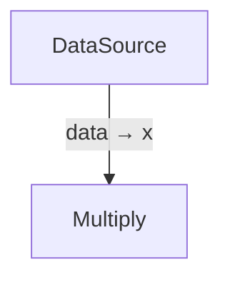
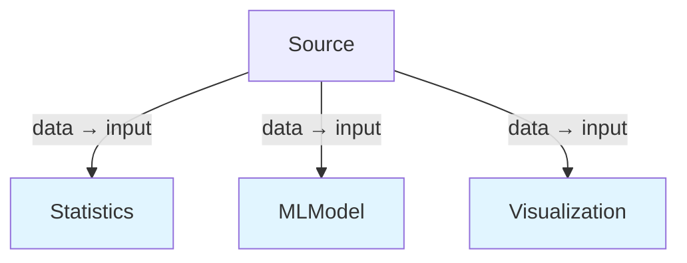
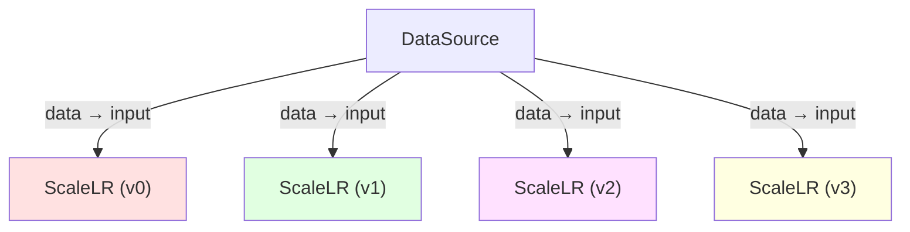

# graph-sp

graph-sp is a pure Rust grid/node graph executor and optimizer. The project focuses on representing directed dataflow graphs, computing port mappings by graph inspection, and executing nodes efficiently in-process with parallel CPU execution.

## Core Features

- **Implicit Node Connections**: Nodes automatically connect based on execution order
- **Parallel Branching**: Create fan-out execution paths with `.branch()`
- **Configuration Variants**: Use `.variant()` to create parameter sweeps
- **DAG Analysis**: Automatic inspection and optimization of execution paths
- **Mermaid Visualization**: Generate diagrams with `.to_mermaid()`
- **In-process Execution**: Parallel execution using rayon

## Installation

Add to your `Cargo.toml`:

```toml
[dependencies]
graph-sp = "0.1.0"
```

## Quick Start

### Basic Sequential Pipeline

```rust
use graph_sp::Graph;
use std::collections::HashMap;

fn data_source(_: &HashMap<String, String>, _: &HashMap<String, String>) -> HashMap<String, String> {
    let mut result = HashMap::new();
    result.insert("value".to_string(), "42".to_string());
    result
}

fn multiply(inputs: &HashMap<String, String>, _: &HashMap<String, String>) -> HashMap<String, String> {
    let mut result = HashMap::new();
    if let Some(val) = inputs.get("x").and_then(|s| s.parse::<i32>().ok()) {
        result.insert("doubled".to_string(), (val * 2).to_string());
    }
    result
}

fn main() {
    let mut graph = Graph::new();
    
    // Add source node
    graph.add(data_source, Some("DataSource"), None, Some(vec![("value", "data")]));
    
    // Add processing node
    graph.add(multiply, Some("Multiply"), Some(vec![("data", "x")]), Some(vec![("doubled", "result")]));
    
    let dag = graph.build();
    let context = dag.execute();
    
    println!("Result: {}", context.get("result").unwrap());
}
```

**Mermaid visualization output:**



### Parallel Branching (Fan-Out)

```rust
let mut graph = Graph::new();

// Source node
graph.add(source_fn, Some("Source"), None, Some(vec![("data", "data")]));

// Create parallel branches
graph.branch();
graph.add(stats_fn, Some("Statistics"), Some(vec![("data", "input")]), Some(vec![("mean", "stats")]));

graph.branch();
graph.add(model_fn, Some("MLModel"), Some(vec![("data", "input")]), Some(vec![("prediction", "model")]));

graph.branch();
graph.add(viz_fn, Some("Visualization"), Some(vec![("data", "input")]), Some(vec![("plot", "viz")]));

let dag = graph.build();
```

**Mermaid visualization output:**



**DAG Statistics:**
- Nodes: 4
- Depth: 2 levels
- Max Parallelism: 3 nodes (all branches execute in parallel)

### Parameter Sweep with Variants

```rust
use graph_sp::{Graph, Linspace};

let mut graph = Graph::new();

// Source node
graph.add(source_fn, Some("DataSource"), None, Some(vec![("value", "data")]));

// Create variants for different learning rates
let learning_rates = vec![0.001, 0.01, 0.1, 1.0];
graph.variant("learning_rate", learning_rates);
graph.add(scale_fn, Some("ScaleLR"), Some(vec![("data", "input")]), Some(vec![("scaled", "output")]));

let dag = graph.build();
```

**Mermaid visualization output:**



**DAG Statistics:**
- Nodes: 5
- Depth: 2 levels
- Max Parallelism: 4 nodes
- Variants: 4 (all execute in parallel)

## API Overview

### Graph Construction

- `Graph::new()` - Create a new graph
- `graph.add(fn, name, inputs, outputs)` - Add a node
  - `fn`: Node function with signature `fn(&HashMap<String, String>, &HashMap<String, String>) -> HashMap<String, String>`
  - `name`: Optional node name
  - `inputs`: Optional vector of `(broadcast_var, impl_var)` tuples for input mappings
  - `outputs`: Optional vector of `(impl_var, broadcast_var)` tuples for output mappings
- `graph.branch()` - Create a new parallel branch
- `graph.variant(param_name, values)` - Create parameter sweep variants
- `graph.build()` - Build the DAG

### DAG Operations

- `dag.execute()` - Execute the graph and return execution context
- `dag.stats()` - Get DAG statistics (nodes, depth, parallelism, branches, variants)
- `dag.to_mermaid()` - Generate Mermaid diagram representation

## Development

Prerequisites:
- Rust (stable toolchain) installed: https://www.rust-lang.org/tools/install

Build and run tests:

```bash
cargo build --release
cargo test
```

Run examples:

```bash
cargo run --example comprehensive_demo
cargo run --example parallel_execution_demo
cargo run --example variant_demo_full
```
