# graph-sp

A high-performance DAG (Directed Acyclic Graph) execution engine with true parallel execution, built in Rust with Python bindings.

[](https://github.com/briday1/graph-sp/actions)
[](https://pypi.org/project/graph-sp/)
[](https://crates.io/crates/graph-sp)

## Features

- **⚡ True Parallel Execution**: Automatic parallelization of independent nodes (44% faster for fan-out patterns)
- **🔌 Port-based Architecture**: Type-safe data flow between nodes via named ports
- **🔗 Implicit Edge Mapping**: Auto-connect nodes by matching port names (no explicit `add_edge()` needed)
- **🐍 Python & Rust APIs**: Full feature parity across both languages
- **🔍 Graph Inspection**: Analysis, visualization, and Mermaid diagram generation
- **🎨 Rich Mermaid Diagrams**: Color-coded nodes, parallel group detection, multi-line labels
- **✅ Cycle Detection**: Built-in DAG validation with detailed error reporting
- **📊 Rich Data Types**: Primitives, collections, JSON, nested objects, and binary data
- **🎯 Zero-Copy Optimization**: Efficient data sharing using Arc

## Quick Start

### Python

Install from PyPI:

```bash
pip install graph-sp
```

Simple example:

```python
import graph_sp

# Create a graph
graph = graph_sp.Graph()

# Add nodes with Python functions
graph.add_node(
    "source", "Data Source",
    [],  # no inputs
    [graph_sp.Port("output", "Numbers")],
    lambda inputs: {"output": [1, 2, 3, 4, 5]}
)

graph.add_node(
    "doubler", "Multiply by 2",
    [graph_sp.Port("input", "Input")],
    [graph_sp.Port("output", "Output")],
    lambda inputs: {"output": [x * 2 for x in inputs["input"]]}
)

# Connect nodes
graph.add_edge("source", "output", "doubler", "input")

# Execute with parallel processing
executor = graph_sp.Executor()
result = executor.execute(graph)

print(result.get_output("doubler", "output"))  # [2, 4, 6, 8, 10]
```

### Rust

Add to your `Cargo.toml`:

```toml
[dependencies]
graph-sp = "0.1"
tokio = { version = "1", features = ["full"] }
```

Simple example:

```rust
use graph_sp::{Graph, Node, NodeConfig, Port, PortData, Edge, Executor};
use std::collections::HashMap;
use std::sync::Arc;

#[tokio::main]
async fn main() -> Result<(), Box<dyn std::error::Error>> {
    let mut graph = Graph::new();

    // Add source node
    let source = NodeConfig::new(
        "source", "Data Source",
        vec![],
        vec![Port::new("output", "Numbers")],
        Arc::new(|_: &HashMap<String, PortData>| {
            Ok(HashMap::from([
                ("output".to_string(), PortData::List(vec![
                    PortData::Int(1), PortData::Int(2), PortData::Int(3)
                ]))
            ]))
        }),
    );

    graph.add_node(Node::new(source))?;

    // Execute
    let executor = Executor::new();
    let result = executor.execute(&mut graph).await?;

    Ok(())
}
```

## Installation

### Python

**From PyPI (recommended):**

```bash
pip install graph-sp
```

**From source:**

```bash
# Clone the repository
git clone https://github.com/briday1/graph-sp.git
cd graph-sp

# Install maturin
pip install maturin

# Build and install
maturin develop --release --features python
```

### Rust

**From crates.io:**

```toml
[dependencies]
graph-sp = "0.1"
```

**From source:**

```bash
git clone https://github.com/briday1/graph-sp.git
cd graph-sp
cargo build --release
```

## Core Concepts

### Ports

Nodes communicate through typed ports:

```python
# Python
input_port = graph_sp.Port("data", "Input Data")
output_port = graph_sp.Port("result", "Processed Result")
```

```rust
// Rust
let input_port = Port::new("data", "Input Data");
let output_port = Port::new("result", "Processed Result");
```

### Data Types

Support for multiple data types:

- **Primitives**: Int, Float, String, Bool, None
- **Collections**: List, Map (nested HashMap)
- **Structured**: JSON (arbitrary structures)
- **Binary**: Bytes (raw binary data)

```python
# Python - nested objects work seamlessly
user = {
    "name": "Alice",
    "age": 30,
    "address": {
        "city": "NYC",
        "zip": "10001"
    },
    "hobbies": ["reading", "coding"]
}
```

### Parallel Execution

The engine automatically parallelizes independent branches:

```python
# This creates a fan-out pattern with 3 parallel branches
#        source
#       /   |   \
#   slow  fast  medium    <- These run in parallel!
#       \   |   /
#        merger

# Execution time: ~500ms (parallel) vs ~900ms (sequential)
# 44% speedup achieved automatically!
```

### Graph Inspection

```python
# Analyze graph structure
analysis = graph.analyze()
print(f"Nodes: {analysis.node_count}")
print(f"Depth: {analysis.depth}")
print(f"Width: {analysis.width}")  # Parallelization potential

# Generate Mermaid diagram
mermaid = graph.to_mermaid()
print(mermaid)  # GitHub-compatible markdown
```

### Implicit Edge Mapping

Build graphs WITHOUT explicit `add_edge()` calls! Edges are automatically created by matching port names:

**Python:**
```python
graph = graph_sp.Graph()

# Add nodes with matching port names
graph.add_node("source", "Data Source", [],
    [graph_sp.Port("data", "Data")], source_fn)

graph.add_node("processor", "Processor",
    [graph_sp.Port("data", "Input")],  # Matches "data" output!
    [graph_sp.Port("result", "Result")], processor_fn)

graph.add_node("sink", "Sink",
    [graph_sp.Port("result", "Input")],  # Matches "result" output!
    [], sink_fn)

# Auto-connect based on port name matching
edges_created = graph.auto_connect()
print(f"✓ Created {edges_created} edges automatically!")
```

**Rust:**
```rust
let mut graph = Graph::new();

// Add nodes with matching port names
graph.add_node(Node::new(NodeConfig::new(
    "source", "Data Source",
    vec![],
    vec![Port::new("data", "Data")],
    function
)))?;

graph.add_node(Node::new(NodeConfig::new(
    "processor", "Processor",
    vec![Port::new("data", "Input")],  // Matches "data" output!
    vec![Port::new("result", "Result")],
    function
)))?;

// Auto-connect based on port name matching
let edges_created = graph.auto_connect()?;
println!("✓ Created {} edges automatically!", edges_created);
```

**Generated Mermaid Diagram:**



```mermaid
graph TD
    source["Data Source"]
    style source fill:#e1f5ff,stroke:#01579b,stroke-width:2px
    processor["Processor"]
    style processor fill:#fff3e0,stroke:#e65100,stroke-width:2px
    sink["Sink"]
    style sink fill:#f3e5f5,stroke:#4a148c,stroke-width:2px

    source -->|"data→data"| processor
    processor -->|"result→result"| sink
```

### Mermaid Visualization Features

Generated diagrams include:
- **Color-coded nodes**: Blue (source), Orange (processing), Purple (sink)
- **Edge labels**: Show port-to-port connections
- **Parallel group detection**: Fan-out/fan-in patterns automatically grouped
- **Multi-line labels**: Use `\n` in node names for line breaks

**Example with parallel branches:**

```python
# Source fans out to 2 branches, which merge
graph.add_node("source", "Value Source", [],
    [graph_sp.Port("value", "Value")], source_fn)

graph.add_node("branch_a", "Branch A\\n(×2)",  # Multi-line label
    [graph_sp.Port("value", "Input")],
    [graph_sp.Port("out_a", "Output")], branch_a_fn)

graph.add_node("branch_b", "Branch B\\n(+50)",  # Multi-line label
    [graph_sp.Port("value", "Input")],
    [graph_sp.Port("out_b", "Output")], branch_b_fn)

graph.add_node("merger", "Merger",
    [graph_sp.Port("out_a", "A"), graph_sp.Port("out_b", "B")],
    [], merger_fn)

graph.auto_connect()  # Creates 4 edges automatically
```

**Generated Mermaid Diagram:**



```mermaid
graph TD
    source["Value Source"]
    style source fill:#e1f5ff,stroke:#01579b,stroke-width:2px
    branch_a["Branch A<br/>(×2)"]
    style branch_a fill:#fff3e0,stroke:#e65100,stroke-width:2px
    branch_b["Branch B<br/>(+50)"]
    style branch_b fill:#fff3e0,stroke:#e65100,stroke-width:2px
    merger["Merger"]
    style merger fill:#f3e5f5,stroke:#4a148c,stroke-width:2px

    %% Parallel Execution Groups Detected
    %% Group 1: 2 nodes executing in parallel

    subgraph parallel_group_1["⚡ Parallel Execution Group 1"]
        direction LR
        branch_b
        branch_a
    end
    style parallel_group_1 fill:#e8f5e9,stroke:#2e7d32,stroke-width:2px,stroke-dasharray: 5 5

    source -->|"value→value"| branch_a
    source -->|"value→value"| branch_b
    branch_a -->|"out_a→out_a"| merger
    branch_b -->|"out_b→out_b"| merger
```

Notice:
- Multi-line labels render with `<br/>`
- Parallel branches are grouped in a dashed green subgraph
- Comments explain the parallel execution pattern
- All edges properly connected (no disconnected nodes)

## Examples

### Python Examples

Located in `python_examples/`:

- **simple_pipeline.py**: Basic 3-node pipeline with graph analysis
- **complex_objects.py**: Demonstrates nested objects, JSON, and lists
- **parallel_execution.py**: Shows 3-branch parallel execution with timing
- **implicit_edges.py**: Demonstrates auto_connect() with parallel branches and multi-line labels

Run an example:

```bash
cd python_examples
python simple_pipeline.py
python implicit_edges.py
```

### Rust Examples

Located in `examples/`:

- **simple_pipeline.rs**: 4-node data processing pipeline
- **complex_objects.rs**: All PortData types with nested structures
- **parallel_execution.rs**: Fan-out/fan-in pattern with performance analysis
- **implicit_edges.rs**: Demonstrates auto_connect() with parallel branches and multi-line labels

Run an example:

```bash
cargo run --example simple_pipeline
cargo run --example parallel_execution
cargo run --example implicit_edges
```

## Performance

Measured with 3-branch parallel execution example:

| Metric | Sequential | Parallel | Improvement |
|--------|-----------|----------|-------------|
| **Rust** | 900ms | 500ms | 44% faster |
| **Python** | 900ms | 502ms | 44% faster |

The executor identifies dependency levels and executes all independent nodes concurrently using `tokio::task::spawn_blocking`.

## Architecture

### Core Components

1. **Data Model** (`src/core/data.rs`)
   - `PortData`: Enum for all supported types
   - `GraphData`: HashMap for port-to-port storage
   - Support for nested structures via recursive variants

2. **Graph** (`src/core/graph.rs`)
   - petgraph-backed DAG representation
   - Topological sorting and cycle detection
   - Type-safe port connections

3. **Executor** (`src/executor/mod.rs`)
   - Dependency-level grouping
   - Concurrent execution with `tokio::task::spawn_blocking`
   - Automatic concurrency management

4. **Inspector** (`src/inspector/mod.rs`)
   - Graph statistics (depth, width, sources, sinks)
   - Mermaid diagram generation
   - Optimization suggestions

5. **Python Bindings** (`src/python/mod.rs`)
   - PyO3-based wrappers
   - GIL-aware parallel execution
   - Automatic type conversion

## Building & Testing

### Rust

```bash
# Run tests
cargo test

# Run with all features
cargo test --all-features

# Build release
cargo build --release

# Run examples
cargo run --example simple_pipeline
```

### Python

```bash
# Install development dependencies
pip install maturin pytest

# Build Python bindings
maturin develop --features python

# Run Python examples
python python_examples/simple_pipeline.py
```

### Build for Multiple Platforms

```bash
# Linux (using Docker for manylinux compatibility)
docker run --rm -v $(pwd):/io ghcr.io/pyo3/maturin build --release --features python

# macOS
maturin build --release --features python

# Windows
maturin build --release --features python
```

## Documentation

- **Python API**: See `python_examples/README.md` for detailed Python usage
- **Rust API**: Run `cargo doc --open` for full API documentation
- **Port Data Types**: See `docs/PORT_DATA_TYPES.md` for supported types

## Publishing

### PyPI

Wheels are automatically built and published to PyPI on version tags:

```bash
git tag v0.1.0
git push origin v0.1.0
```

Builds wheels for:
- Linux (manylinux)
- macOS (Intel & ARM)
- Windows

### Crates.io

```bash
cargo publish
```

## Contributing

Contributions welcome! Please:

1. Fork the repository
2. Create a feature branch
3. Add tests for new functionality
4. Ensure all tests pass (`cargo test --all-features`)
5. Submit a pull request

## License

MIT License - see LICENSE file for details

## Roadmap

- [x] True parallel execution
- [x] Python bindings with PyPI distribution
- [x] Mermaid diagram generation with parallel group detection
- [x] Implicit edge mapping (auto_connect)
- [x] Multi-line labels in Mermaid diagrams
- [x] Comprehensive examples
- [ ] Distributed execution support
- [ ] Graph serialization/deserialization
- [ ] WebAssembly support
- [ ] Real-time monitoring dashboard
- [ ] Advanced optimization algorithms

