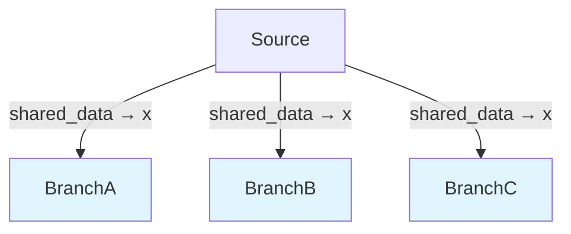

# dagex

A pure Rust DAG (Directed Acyclic Graph) executor with Python bindings for building and executing computational pipelines.

## Features

- **Implicit Node Connections**: Nodes automatically connect based on execution order
- **Parallel Branching**: Create fan-out execution paths with `.branch()`
- **Configuration Variants**: Use `.variant()` to create parameter sweeps
- **Mermaid Visualization**: Generate diagrams with `.to_mermaid()`
- **Parallel Execution**: Execute independent branches concurrently
- **Native Performance**: Rust-powered execution with Python convenience
- **Memory Efficient**: Zero-copy data sharing between nodes using Arc (18x performance improvement for large datasets)

## Installation

```bash
pip install dagex
```

No Rust toolchain required - prebuilt wheels are available for all major platforms.

## Quick Start

### Basic Pipeline

```python
import dagex

def data_source(inputs, variant_params):
    """Generate initial data"""
    return {"value": 42}

def multiply(inputs, variant_params):
    """Process the data"""
    val = inputs.get("x", 0)
    return {"doubled": val * 2}

# Create graph
graph = dagex.Graph()

# Add nodes
graph.add(
    function=data_source,
    label="DataSource",
    inputs=None,
    outputs=[("value", "data")]
)

graph.add(
    function=multiply,
    label="Multiply",
    inputs=[("data", "x")],
    outputs=[("doubled", "result")]
)

# Build and execute
dag = graph.build()
context = dag.execute()

print(f"Result: {context['result']}")  # Output: Result: 84
```

### Parallel Branching

Create multiple parallel processing paths:

```python
import dagex
import time

def source(inputs, variant_params):
    return {"data": 100}

def branch_a(inputs, variant_params):
    time.sleep(0.1)  # Simulate work
    return {"result_a": inputs["x"] * 2}

def branch_b(inputs, variant_params):
    time.sleep(0.1)  # Simulate work
    return {"result_b": inputs["x"] * 3}

def branch_c(inputs, variant_params):
    time.sleep(0.1)  # Simulate work
    return {"result_c": inputs["x"] + 50}

graph = dagex.Graph()

# Source node
graph.add(source, label="Source", outputs=[("data", "shared_data")])

# Create parallel branches
graph.branch()
graph.add(branch_a, label="BranchA", inputs=[("shared_data", "x")], outputs=[("result_a", "a")])

graph.branch()
graph.add(branch_b, label="BranchB", inputs=[("shared_data", "x")], outputs=[("result_b", "b")])

graph.branch()
graph.add(branch_c, label="BranchC", inputs=[("shared_data", "x")], outputs=[("result_c", "c")])

dag = graph.build()
result = dag.execute(parallel=True)

print(f"Branch A (100*2): {result['a']}")  # 200
print(f"Branch B (100*3): {result['b']}")  # 300
print(f"Branch C (100+50): {result['c']}")  # 150
```

### Visualization

Generate Mermaid diagrams to visualize your pipeline:

```python
print(dag.to_mermaid())
```

Output:


## Working with NumPy Arrays

dagex seamlessly handles NumPy arrays and complex numbers:

```python
import dagex
import numpy as np

def generate_signal(inputs, variant_params):
    """Generate a complex signal"""
    samples = 256
    t = np.linspace(0, 1, samples)
    signal = np.exp(2j * np.pi * 10 * t)  # 10 Hz complex exponential
    return {
        "signal": signal,  # numpy array passed directly
        "num_samples": samples
    }

def process_signal(inputs, variant_params):
    """Process with FFT"""
    signal = np.array(inputs["signal"], dtype=complex)
    spectrum = np.fft.fft(signal)
    magnitude = np.abs(spectrum)
    peak_freq = np.argmax(magnitude)
    
    return {
        "spectrum": spectrum,
        "peak_frequency": int(peak_freq)
    }

graph = dagex.Graph()

graph.add(
    generate_signal,
    label="GenerateSignal",
    outputs=[("signal", "sig"), ("num_samples", "n")]
)

graph.add(
    process_signal,
    label="ProcessSignal",
    inputs=[("sig", "signal")],
    outputs=[("spectrum", "spec"), ("peak_frequency", "peak")]
)

dag = graph.build()
result = dag.execute()

print(f"Peak frequency bin: {result['peak']}")
```

### Data Types

dagex supports any Python data type:

- **Primitives**: int, float, str, bool
- **Complex numbers**: Built-in `complex` and `numpy.complex128`
- **Collections**: list, dict, tuple
- **NumPy arrays**: All dtypes including complex arrays
- **Custom objects**: Any Python object can be passed through the graph

The framework doesn't impose type restrictions - your node functions determine what data flows through the pipeline.

## API Reference

### Graph

- `Graph()` - Create a new graph builder
- `graph.add(function, label=None, inputs=None, outputs=None)` - Add a node
  - `function`: Callable with signature `(inputs: dict, variant_params: dict) -> dict`
  - `label`: Optional node name (str)
  - `inputs`: List of `(broadcast_var, node_input_var)` tuples
  - `outputs`: List of `(node_output_var, broadcast_var)` tuples
- `graph.branch(subgraph=None)` - Create a parallel branch
- `graph.build()` - Build the DAG and return a `Dag` object

### Dag

- `dag.execute(parallel=False, max_threads=None)` - Execute the graph
  - `parallel`: Enable parallel execution of independent nodes
  - `max_threads`: Limit concurrent threads (None = unlimited)
  - Returns: `dict` with all broadcast variables
- `dag.to_mermaid()` - Generate Mermaid diagram (str)

## Examples

The package includes several example scripts:

- **`python_demo.py`** - Basic pipeline construction
- **`python_comprehensive_demo.py`** - Multiple pipeline patterns
- **`python_parallel_demo.py`** - Parallel execution examples
- **`python_data_types_demo.py`** - Working with various data types
- **`python_radar_demo.py`** - Signal processing pipeline with NumPy

Find them in the [examples/py directory](https://github.com/briday1/dagex/tree/main/examples/py) on GitHub.

## Performance Notes

- The DAG executor is written in Rust for performance
- Python functions are called from Rust with proper GIL handling
- Parallel execution releases the GIL during graph traversal
- For CPU-bound Python code, use libraries like NumPy that release the GIL internally
- Best performance gains with parallel execution of I/O-bound or NumPy-based operations

## License

MIT License - see [LICENSE](https://github.com/briday1/dagex/blob/main/LICENSE) for details.

## Links

- **GitHub**: https://github.com/briday1/dagex
- **Documentation**: https://docs.rs/dagex
- **PyPI**: https://pypi.org/project/dagex
- **Crates.io**: https://crates.io/crates/dagex
