```mermaid
graph TD
    0["Generator"]
    1["Doubler"]
    2["AddFive"]
    0 -->|x → x| 1
    1 -->|y → y| 2
```

```mermaid
graph TD
    0["Source"]
    1["TaskA"]
    2["TaskB"]
    3["TaskC"]
    0 -->|input → input| 1
    0 -->|input → input| 2
    0 -->|input → input| 3
```

```mermaid
graph TD
    0["Source"]
    1["PathA (+10)"]
    2["PathB (+20)"]
    3["Combine"]
    0 -->|x → x| 1
    0 -->|x → x| 2
    1 --> 3
    2 --> 3
```

```mermaid
graph TD
    0["DataSource"]
    1["Multiplier (v0)"]
    2["Multiplier (v1)"]
    3["Multiplier (v2)"]
    4["Multiplier (v3)"]
    0 -->|x → x| 1
    0 -->|x → x| 2
    0 -->|x → x| 3
    0 -->|x → x| 4
```

```mermaid
graph TD
    0["CreateLargeData"]
    1["ConsumerA"]
    2["ConsumerB"]
    3["ConsumerC"]
    0 -->|data → data| 1
    0 -->|data → data| 2
    0 -->|data → data| 3
```

# dagex - Python Edition

A pure Rust DAG executor with Python bindings for building and executing complex computational workflows.

## 🚀 Quick Start

```bash
pip install dagex
```

## 📖 Overview

**dagex** provides a powerful yet simple API for building directed acyclic graphs (DAGs) of computational tasks. Key features:

- **Automatic dependency resolution** based on data flow
- **Parallel execution** of independent nodes
- **Branching** for creating independent subgraphs
- **Variants** for parameter sweeps and A/B testing
- **Mermaid diagrams** for visualizing your pipeline

### Python Parallel Execution & the GIL

Python's Global Interpreter Lock (GIL) means that pure Python computations cannot achieve true parallelism. However, **dagex enables true parallel execution** when your node functions perform operations that release the GIL, such as:

- **I/O operations**: File reads/writes, network calls, database queries
- **NumPy/SciPy operations**: Most numerical computations in these libraries release the GIL
- **C extensions**: Custom C/Rust extensions that release the GIL
- **Sleep/wait operations**: Simulating blocking operations

The examples in this package use `time.sleep()` to demonstrate parallelization benefits, as sleep operations release the GIL and allow other threads to run concurrently.

## 🎯 Basic Example

```python
import dagex

def generate(_inputs):
    return {"n": 7}

def double(inputs):
    v = inputs.get("x", 0)
    return {"y": v * 2}

# Build graph
g = dagex.Graph()
g.add(generate, label="Source", inputs=None, outputs=[("n", "x")])
g.add(double, label="Double", inputs=[("x", "x")], outputs=[("y", "out")])

# Execute
dag = g.build()
print(dag.to_mermaid())  # Visualize
context = dag.execute(parallel=False)
print('Result:', context.get('out'))  # Result: 14
```

## 📚 Examples

All examples can be run directly:

```bash
python3 examples/py/01_minimal_pipeline.py
python3 examples/py/02_parallel_vs_sequential.py
python3 examples/py/03_branch_and_merge.py
python3 examples/py/04_variants_sweep.py
python3 examples/py/05_output_access.py
python3 examples/py/06_graphdata_large_payload_arc_or_shared_data.py
```

### Example 01: Minimal Pipeline

The simplest possible pipeline: generator → transformer → aggregator.

**Description:**
Shows a basic 3-node pipeline where each node depends on the previous one. Demonstrates the fundamental dataflow concept.

**Syntax:**
```python
import dagex

graph = dagex.Graph()

# Add nodes to the pipeline
graph.add(
    generate,                    # Python callable
    label="Generator",
    inputs=None,                 # No inputs (source node)
    outputs=[("number", "x")]    # Output mapping: impl → broadcast
)

graph.add(
    double,
    label="Doubler",
    inputs=[("x", "x")],         # Input mapping: broadcast → impl
    outputs=[("result", "y")]
)

# Build and execute
dag = graph.build()
context = dag.execute(parallel=False)  # Sequential
context = dag.execute(parallel=True)   # Parallel
```

**Mermaid Diagram:**


**Performance (Sequential):**
```
⏱️  Runtime: 0.024ms
💾 Memory: Current: 0.05 KB, Peak: 0.05 KB
```

**Performance (Parallel):**
```
⏱️  Runtime: 0.032ms
💾 Memory: Current: 0.06 KB, Peak: 0.06 KB
```

**Output:**
```
✅ Pipeline completed successfully!
   (Started with 10, doubled to 20, added 5 = 25)
```

### Example 02: Parallel vs Sequential Execution

Demonstrates the power of parallel execution.

**Description:**
Shows three independent tasks (A, B, C) that each take ~50ms. When executed sequentially, they take ~150ms total. When executed in parallel, they complete in ~50ms—a **3x speedup**!

**Syntax:**
```python
import dagex

# Add independent tasks that can run in parallel
graph.add(task_a, label="TaskA", inputs=[("input", "input")], outputs=[("result_a", "a")])
graph.add(task_b, label="TaskB", inputs=[("input", "input")], outputs=[("result_b", "b")])
graph.add(task_c, label="TaskC", inputs=[("input", "input")], outputs=[("result_c", "c")])

dag = graph.build()

# Compare sequential vs parallel execution
context_seq = dag.execute(parallel=False)           # Sequential
context_par = dag.execute(parallel=True, max_threads=4)  # Parallel
```

**Mermaid Diagram:**


**Performance (Sequential):**
```
⏱️  Runtime: 150.3ms
💾 Memory: Current: 0.10 KB, Peak: 0.12 KB
```

**Performance (Parallel):**
```
⏱️  Runtime: 50.5ms
💾 Memory: Current: 0.15 KB, Peak: 0.18 KB
⚡ Speedup: 2.98x faster with parallel execution!
```

**Output:**
```
Sequential results:
  TaskA: 110
  TaskB: 120
  TaskC: 130

Parallel results:
  TaskA: 110
  TaskB: 120
  TaskC: 130
```

### Example 03: Branching

Create independent execution paths that run in parallel.

**Description:**
Demonstrates creating independent branches that process data in parallel. Each branch contains its own subgraph that can have multiple nodes.

**Syntax:**
```python
import dagex

# Create branches
branch_a = dagex.Graph()
branch_a.add(path_a, label="PathA (+10)", inputs=[("x", "x")], outputs=[("result", "a")])
branch_a_id = graph.branch(branch_a)

branch_b = dagex.Graph()
branch_b.add(path_b, label="PathB (+20)", inputs=[("x", "x")], outputs=[("result", "b")])
branch_b_id = graph.branch(branch_b)

# Add a node to combine branch outputs
graph.add(
    combine,
    label="Combine",
    inputs=[("a", "a"), ("b", "b")],
    outputs=[("combined", "final")]
)
```

**Mermaid Diagram:**


**Performance (Sequential):**
```
⏱️  Runtime: 0.08ms
💾 Memory: Current: 0.05 KB, Peak: 0.06 KB
```

**Performance (Parallel):**
```
⏱️  Runtime: 0.12ms
💾 Memory: Current: 0.08 KB, Peak: 0.10 KB
```

**Output:**
```
📊 Execution flow:
   Source: 50
   PathA: 50 + 10 = 60
   PathB: 50 + 20 = 70
   Combine: 60 + 70 = 130

✅ Final output: 130
```

### Example 04: Variants (Parameter Sweep)

Run multiple parameter configurations in parallel.

**Description:**
Demonstrates running multiple nodes with the same structure but different parameters. All variants execute at the same level in the DAG, enabling efficient parallel exploration of parameter spaces.

**Syntax:**
```python
import dagex

# Factory function to create variants with different parameters
def make_multiplier(factor):
    def multiplier(inputs):
        value = inputs.get("x", 0)
        return {"result": value * factor}
    return multiplier

# Create multiple variants
factors = [2, 3, 5, 7]
variant_nodes = [make_multiplier(f) for f in factors]

# Add all variants at once
graph.variants(
    variant_nodes,
    label="Multiplier",
    inputs=[("x", "x")],
    outputs=[("result", "results")]
)
```

**Mermaid Diagram:**


**Performance (Sequential):**
```
⏱️  Runtime: 0.06ms
💾 Memory: Current: 0.05 KB, Peak: 0.06 KB
```

**Performance (Parallel):**
```
⏱️  Runtime: 0.10ms
💾 Memory: Current: 0.08 KB, Peak: 0.10 KB
```

**Output:**
```
📊 Base value: 10

Detailed variant outputs:
  Variant 0 (×2): 20
  Variant 1 (×3): 30
  Variant 2 (×5): 50
  Variant 3 (×7): 70

✅ All 4 variants executed successfully!
```

### Example 05: Output Access

Access outputs from different parts of the graph.

**Description:**
Demonstrates accessing final outputs from the context. While Python bindings primarily expose the final context (global broadcast space), this example shows how to work with branching and understand the flow of data through the graph.

**Syntax:**
```python
import dagex

# Execute the graph
context = dag.execute(parallel=True, max_threads=4)

# Access final outputs from the context
output = context.get("output")
print(f"Final output: {output}")

# The context contains all values in the global broadcast space
# that were produced by nodes via their output mappings
```

**Mermaid Diagram:**


**Performance (Sequential):**
```
⏱️  Runtime: 0.09ms
💾 Memory: Current: 0.05 KB, Peak: 0.06 KB
```

**Performance (Parallel):**
```
⏱️  Runtime: 0.15ms
💾 Memory: Current: 0.10 KB, Peak: 0.12 KB
```

**Output:**
```
📊 Accessing outputs:

Final context outputs:
   output: 351

Execution flow:
   Source: 100
   ProcessorA (branch A): 100 × 2 = 200
   ProcessorB (branch B): 100 + 50 = 150
   Combine: 200 + 150 + 1 = 351
```

### Example 06: Efficient Data Sharing

Python's reference counting means large data is automatically shared efficiently.

**Description:**
Demonstrates efficient memory handling for large datasets in Python. Objects are reference-counted, so passing lists/arrays to multiple consumers shares references rather than copying data. For even better performance, use NumPy arrays which are efficiently passed through the Python/Rust boundary.

**Syntax:**
```python
import dagex

def create_large_data(_inputs):
    # Create a large list - Python's reference counting means
    # this data is shared by reference, not copied
    large_list = list(range(1_000_000))
    return {"large_data": large_list}

# Multiple consumers receive references to the same data
graph.add(consumer_a, label="ConsumerA", inputs=[("data", "data")], outputs=[("sum_a", "sum_a")])
graph.add(consumer_b, label="ConsumerB", inputs=[("data", "data")], outputs=[("sum_b", "sum_b")])
graph.add(consumer_c, label="ConsumerC", inputs=[("data", "data")], outputs=[("sum_c", "sum_c")])

# All consumers access the same data by reference - no copying!
```

**Mermaid Diagram:**


**Performance (Sequential):**
```
⏱️  Runtime: 305.5ms
💾 Memory: Current: 39050 KB, Peak: 39060 KB
```

**Performance (Parallel):**
```
⏱️  Runtime: 310.2ms
💾 Memory: Current: 39055 KB, Peak: 39065 KB
```

**Output:**
```
📊 Consumer outputs (each processes different segments):
   ConsumerA (first 1000):  sum = 499500
   ConsumerB (next 1000):   sum = 1499500
   ConsumerC (next 1000):   sum = 2499500

✅ Reference-based data sharing successful!
   Memory benefit: Data shared by reference, not copied
```

## 🔧 API Reference

### Graph

Create and configure a computational graph:

```python
import dagex

graph = dagex.Graph()

# Add a node
graph.add(
    function,                    # Python callable
    label="NodeName",            # Optional label
    inputs=[("src", "dst")],     # Input mapping: broadcast → impl
    outputs=[("impl", "bcast")]  # Output mapping: impl → broadcast
)

# Create a branch
branch = dagex.Graph()
# ... add nodes to branch ...
branch_id = graph.branch(branch)

# Add variants (parameter sweep)
graph.variants(
    [func1, func2, func3],       # List of callables
    label="Variants",
    inputs=[("input", "x")],
    outputs=[("output", "results")]
)

# Build the DAG
dag = graph.build()
```

### DAG Execution

```python
# Execute the graph
context = dag.execute(
    parallel=True,      # Enable parallel execution
    max_threads=4       # Limit thread count (optional)
)

# Access results
result = context.get("output_name")
```

### Visualization

```python
# Generate Mermaid diagram
mermaid_text = dag.to_mermaid()
print(mermaid_text)
```

## 💡 Tips and Best Practices

### Data Types

- **Integers and floats** are passed efficiently
- **Lists and dicts** are passed by reference (no copying unless you modify them)
- **NumPy arrays** work well for large numerical data

### Performance

- Use `parallel=True` when you have independent nodes at the same level
- Set `max_threads` to control resource usage
- Large data structures are reference-counted, not copied

### Debugging

- Use `to_mermaid()` to visualize your graph structure
- Print intermediate results to understand data flow
- Start with `parallel=False` for easier debugging

## 🔗 Links

- **PyPI Package:** https://pypi.org/project/dagex
- **Repository:** https://github.com/briday1/graph-sp
- **Rust Documentation:** https://docs.rs/dagex
- **Issues:** https://github.com/briday1/graph-sp/issues

## 📄 License

MIT License - see LICENSE file for details.

---

<p align="center">Built with ❤️ — enjoy composing DAGs!</p>
