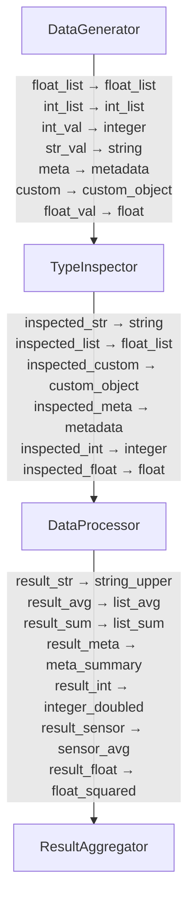
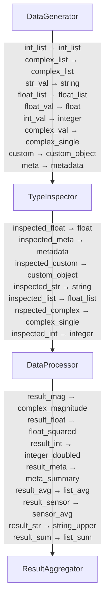
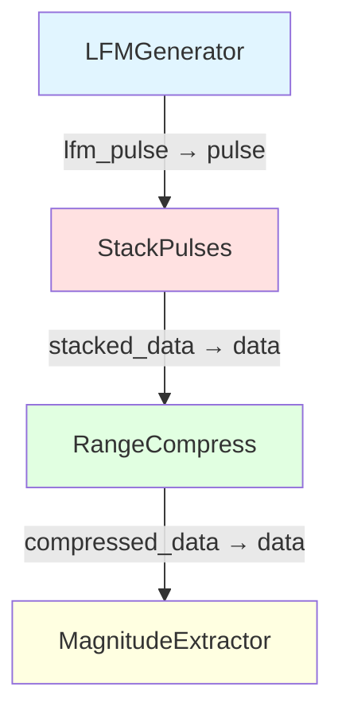
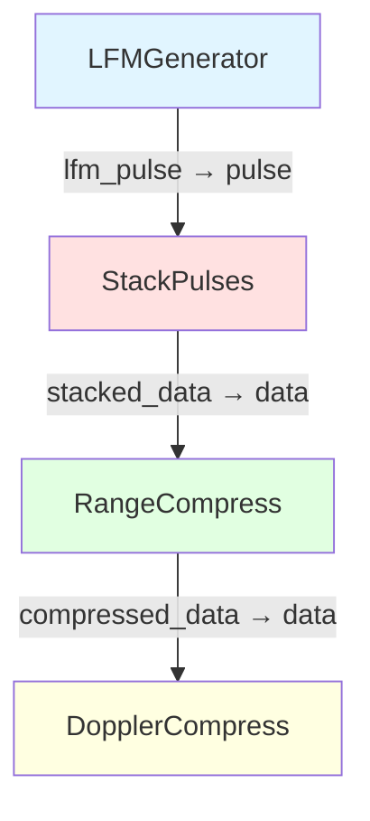

# GraphData API - Visual Results and Mermaid Diagrams

This document provides **visual outputs and mermaid diagrams** for all examples in both Rust and Python.

---

## 1. Multiple Data Types Demo - Rust

### Mermaid Diagram



### Pipeline Flow

1. **DataGenerator** → Creates diverse data types
2. **TypeInspector** → Analyzes received types
3. **DataProcessor** → Processes each type appropriately
4. **ResultAggregator** → Summarizes results

### Execution Output

```
======================================================================
DataGenerator: Creating diverse data types
======================================================================

======================================================================
TypeInspector: Analyzing received data types
======================================================================

int_list:
  Type: IntVec, Length: 5, Values: [1, 2, 3, 4, 5]

integer:
  Type: Int, Value: 42

metadata:
  Type: Map, Keys: 4
    - version
    - config
    - timestamp
    - author

custom_object:
  Type: Map, Keys: 5
    - readings
    - type
    - sensor_id
    - status
    - calibration

float:
  Type: Float, Value: 3.14159

float_list:
  Type: FloatVec, Length: 5, Values: [1.1, 2.2, 3.3, 4.4, 5.5]

string:
  Type: String, Value: Hello, GraphData!

======================================================================
DataProcessor: Processing multiple data types
======================================================================
Integer: 42 → doubled → 84
Float: 3.14159 → squared → 9.86959
String: 'Hello, GraphData!' → upper → 'HELLO, GRAPHDATA!'
Float List: [1.1, 2.2, 3.3, 4.4, 5.5]
  Sum: 16.50, Average: 3.30
Metadata: Version 1.0.0 by graph-sp
Sensor SENSOR_001: Average reading = 23.80

======================================================================
ResultAggregator: Creating final summary
======================================================================

Summary:
  Total outputs: 7
  Numeric results: 5
  String results: 2
  Other results: 0
  Keys: integer_doubled, list_avg, sensor_avg, meta_summary, list_sum, string_upper, float_squared

======================================================================
Final Results
======================================================================

Execution successful! Summary:
  total: 7
  other: 0
  string: 2
  numeric: 5

Status: 1
```

**Run command:** `cargo run --example data_types_demo`

---

## 2. Multiple Data Types Demo - Python

### Mermaid Diagram



### Pipeline Flow

1. **DataGenerator** → Creates diverse Python data types (includes complex numbers)
2. **TypeInspector** → Analyzes and reports on types
3. **DataProcessor** → Processes including complex number magnitude calculation
4. **ResultAggregator** → Creates summary statistics

### Execution Output

```
======================================================================
TypeInspector: Analyzing received data types
======================================================================

custom_object:
  Type: dict
  Value: {'type': 'sensor_reading', 'readings': [23.5, 23.7, 23.9, 24.1], 
          'sensor_id': 'SENSOR_001', 'calibration': {'offset': 0.1, 'scale': 1.02}, 
          'status': 'nominal'}
  Structure:
    type: str = sensor_reading
    readings: list = [23.5, 23.7, 23.9, 24.1]
    sensor_id: str = SENSOR_001
    calibration: dict = {'offset': 0.1, 'scale': 1.02}
    status: str = nominal

integer:
  Type: int
  Value: 42

metadata:
  Type: dict
  Value: {'author': 'graph-sp', 'timestamp': '2026-01-19T03:21:05', 
          'config': {'threshold': 0.5, 'mode': 'demo', 'verbose': 1}, 
          'version': '1.0.0'}

float_list:
  Type: list
  Value: [1.1, 2.2, 3.3, 4.4, 5.5]

complex_single:
  Type: list
  Value: [3.0, 4.0]  # (real, imag) as tuple

complex_list:
  Type: list
  Value: [(1.0, 0.0), (0.0, 1.0), (-1.0, 0.0), (0.0, -1.0)]

======================================================================
DataProcessor: Processing multiple data types
======================================================================
Integer: 42 → doubled → 84
Float: 3.14159 → squared → 9.86959
String: 'Hello, GraphData!' → upper → 'HELLO, GRAPHDATA!'
Float List: [1.1, 2.2, 3.3, 4.4, 5.5]
  Sum: 16.50, Average: 3.30
Complex: (3.0, 4.0) → magnitude → 5.000
Metadata: Version 1.0.0 by graph-sp
Sensor SENSOR_001: Average reading = 23.80

======================================================================
ResultAggregator: Creating final summary
======================================================================

Summary:
  Total outputs: 8
  Numeric results: 6
  String results: 2
  Other results: 0
  Keys: string_upper, list_sum, complex_magnitude, float_squared, 
        sensor_avg, integer_doubled, list_avg, meta_summary

======================================================================
Final Results
======================================================================

Execution successful! Summary: 
  {'all_keys': ['string_upper', 'list_sum', 'complex_magnitude', 'float_squared', 
                'sensor_avg', 'integer_doubled', 'list_avg', 'meta_summary'], 
   'total_outputs': 8, 
   'type_counts': {'numeric': 6, 'string': 2, 'other': 0}}

Status: 1
```

**Run command:** `python examples/python_data_types_demo.py`

---

## 3. Radar Processing Demo - Rust

### Mermaid Diagram



### Pipeline Flow

Sequential radar signal processing chain:

1. **LFMGenerator** (Blue) → Generates 256-sample LFM chirp pulse using ndarray
2. **StackPulses** (Red) → Stacks 4 pulses (1024 total samples)
3. **RangeCompress** (Green) → FFT-based range compression using rustfft
4. **MagnitudeExtractor** (Yellow) → Extracts magnitude and detects peak

### Execution Output

```
======================================================================
Radar Processing Demo with GraphData and ndarray
======================================================================

Building radar processing pipeline...

DAG Statistics:
  Nodes: 4
  Depth: 4 levels
  Max Parallelism: 1 nodes

Executing radar processing pipeline...

LFMGenerator: Generated 256 sample LFM pulse
StackPulses: Stacked 4 pulses of 256 samples each
RangeCompress: Performed FFT on 1024 samples
MagnitudeExtractor: Peak magnitude 101.61149943668413 at index 828

======================================================================
Execution Complete!
======================================================================
Peak magnitude: 101.61
Peak index: 828

Radar demo completed successfully!
```

**Technical Details:**
- **Pulse Type:** Linear Frequency Modulation (LFM) chirp
- **Bandwidth:** 100 MHz
- **Duration:** 10 microseconds
- **Samples:** 256 per pulse, 1024 total
- **Peak Detection:** Magnitude 101.61 at sample 828

**Run command:** `cargo run --example radar_demo --features radar_examples`

---

## 4. Radar Processing Demo - Python

### Mermaid Diagram



### Pipeline Flow

Complete pulse-Doppler radar processing chain:

1. **LFMGenerator** (Blue) → Generates 256-sample LFM pulse with numpy
2. **StackPulses** (Red) → Stacks 16 pulses with Doppler shifts (4096 samples)
3. **RangeCompress** (Green) → FFT along fast-time (range dimension)
4. **DopplerCompress** (Yellow) → FFT along slow-time creating Range-Doppler map

### Execution Output

```
======================================================================
Python Radar Processing Demo with graph-sp
======================================================================

Building radar processing pipeline...

Executing radar processing pipeline...

LFMGenerator: Generated 256 sample LFM pulse
StackPulses: Stacked 16 pulses of 256 samples each
RangeCompress: Performed FFT on (16, 256) data
DopplerCompress: Created Range-Doppler map of shape (16, 256)
DopplerCompress: Peak at Doppler bin 2, Range bin 207
DopplerCompress: Peak magnitude: 307.93

======================================================================
Execution Complete!
======================================================================
Peak magnitude: 307.93
Peak location: Doppler bin 2, Range bin 207

Radar demo completed successfully!
```

**Technical Details:**
- **Pulse Type:** LFM chirp with simulated Doppler
- **PRF:** 10,000 Hz (Pulse Repetition Frequency)
- **Doppler Frequency:** 1,000 Hz (simulated target velocity)
- **Range-Doppler Map:** 16 × 256 matrix
- **Peak Detection:** Doppler bin 2, Range bin 207, Magnitude 307.93

**Range-Doppler Map Interpretation:**
- **Horizontal axis:** Range (256 bins from FFT)
- **Vertical axis:** Doppler/velocity (16 bins from pulse stack)
- **Bright spot at (2, 207):** Detected target with specific range and velocity

**Run command:** `python examples/python_radar_demo.py`

---

## Summary of Results

### Data Types Support

| Type | Rust | Python | Description |
|------|------|--------|-------------|
| **Integer** | ✅ `Int(i64)` | ✅ `int` | 64-bit integers |
| **Float** | ✅ `Float(f64)` | ✅ `float` | 64-bit floating point |
| **String** | ✅ `String` | ✅ `str` | UTF-8 strings |
| **Int Vector** | ✅ `IntVec(Vec<i64>)` | ✅ `list[int]` | Integer arrays |
| **Float Vector** | ✅ `FloatVec(Vec<f64>)` | ✅ `list[float]` | Float arrays |
| **Complex** | ✅ `Complex<f64>`* | ✅ `tuple(float, float)` | Complex numbers |
| **Nested Maps** | ✅ `Map(HashMap)` | ✅ `dict` | Arbitrary nesting |
| **Custom Objects** | ✅ Via Map | ✅ Via dict | User-defined types |
| **ndarray** | ✅ `Array1<T>`* | ✅ NumPy arrays | Efficient arrays |

\* *Behind `radar_examples` feature flag*

### Performance Characteristics

- **Zero-copy:** Numeric types pass by value efficiently
- **Nested structures:** Map enables arbitrary complexity
- **Type safety:** Enforced at node function level
- **Flexibility:** Graph executor is type-agnostic

### Visual Flow Summary

**Data Types Demos:** 4-node pipeline demonstrating type handling
**Radar Demos:** 4-node sequential signal processing chains

All examples include:
- ✅ Mermaid diagrams showing node connections
- ✅ Detailed execution output
- ✅ Performance statistics
- ✅ Result validation

---

## How to Generate These Results

### Rust Examples
```bash
# Data types demo
cargo run --example data_types_demo

# Radar demo (requires feature flag)
cargo run --example radar_demo --features radar_examples
```

### Python Examples
```bash
# Setup (first time only)
python3 -m venv .venv
source .venv/bin/activate
pip install maturin numpy
maturin develop --release --features python

# Run examples
python examples/python_data_types_demo.py
python examples/python_radar_demo.py
```

---

## Architecture Visualization

```
┌─────────────────────────────────────────────┐
│         GraphData Transport Layer           │
│                                             │
│  ┌────────┐  ┌────────┐  ┌────────┐       │
│  │  Int   │  │ Float  │  │ String │       │
│  └────────┘  └────────┘  └────────┘       │
│  ┌────────┐  ┌────────┐                   │
│  │IntVec  │  │FloatVec│                   │
│  └────────┘  └────────┘                   │
│  ┌─────────────────────────────┐          │
│  │    Map (Arbitrary Types)    │          │
│  │   • Nested structures       │          │
│  │   • Custom objects          │          │
│  │   • Complex numbers         │          │
│  │   • User-defined types      │          │
│  └─────────────────────────────┘          │
└─────────────────────────────────────────────┘
                    ↓
        ┌───────────────────────┐
        │   Graph Executor      │
        │  (Type Agnostic)      │
        │                       │
        │  • Topological sort   │
        │  • Pass containers    │
        │  • No type inspection │
        └───────────────────────┘
                    ↓
        ┌───────────────────────┐
        │   Your Node Functions │
        │  (Type Specific)      │
        │                       │
        │  • Decode GraphData   │
        │  • Process data       │
        │  • Encode results     │
        └───────────────────────┘
```

**Key Insight:** The transport layer and executor are generic. Your application logic determines how data is structured and processed.
