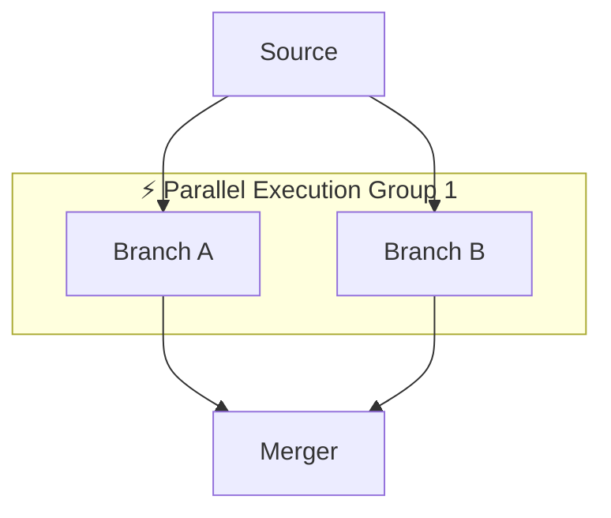
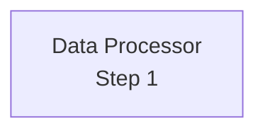
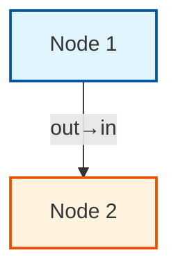
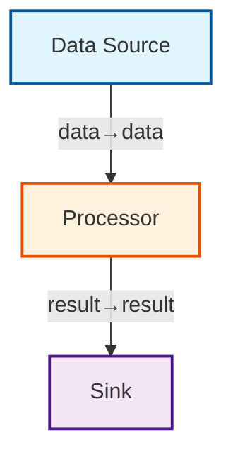
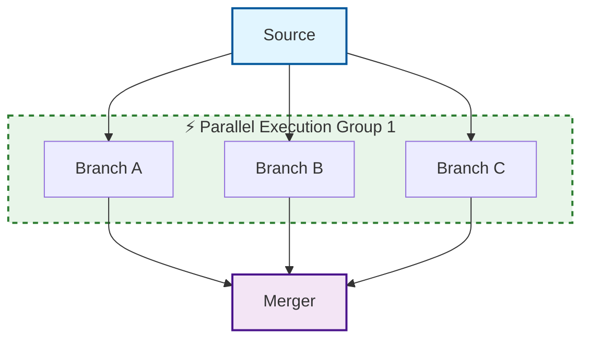
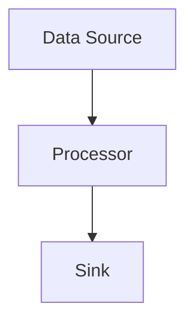

# Mermaid Diagram Visualization

## Overview

Graph-sp automatically generates Mermaid diagrams to visualize your execution graphs. The visualization includes:
- Color-coded node types (source, processing, sink)
- Edge labels showing port connections
- Parallel execution group detection
- Multi-line label support
- GitHub-compatible markdown output

## Features

### 1. Node Styling

Nodes are automatically styled based on their role:

- **Source nodes** (no inputs): Blue background `#e1f5ff`
- **Processing nodes**: Orange background `#fff3e0`
- **Sink nodes** (no outputs): Purple background `#f3e5f5`

### 2. Edge Labels

Edges show the port-to-port connection:
```
source -->|"output_port→input_port"| destination
```

### 3. Parallel Execution Groups

Fan-out/fan-in patterns are automatically detected and grouped:



Groups are:
- Highlighted with dashed green borders
- Labeled with "⚡ Parallel Execution Group N"
- Arranged left-to-right for better visualization

### 4. Multi-line Labels

Use `\n` in node names for multi-line labels:

**Rust:**
```rust
NodeConfig::new(
    "processor",
    "Data Processor\\nStep 1",  // Double backslash
    ...
)
```

**Python:**
```python
graph.add_node(
    "processor",
    "Data Processor\\nStep 1",  # Backslash-n
    ...
)
```

**Output:**


The `\n` is automatically converted to `<br/>` for proper Mermaid rendering.

## Usage

### Rust

```rust
use graph_sp::inspector::Inspector;

let mermaid = Inspector::to_mermaid(&graph)?;
println!("{}", mermaid);
```

### Python

```python
mermaid = graph.to_mermaid()
print(mermaid)
```

## Output Format

The generated Mermaid diagram is wrapped in markdown code fences:

````markdown

````

This format is compatible with:
- GitHub README files
- GitHub Issues and Pull Requests
- GitLab markdown
- Many documentation tools

## Examples

### Simple Pipeline

```rust
let mut graph = Graph::new();

graph.add_node(Node::new(NodeConfig::new(
    "source", "Data Source",
    vec![],
    vec![Port::new("data", "Data")],
    function
)))?;

graph.add_node(Node::new(NodeConfig::new(
    "processor", "Processor",
    vec![Port::new("data", "Data")],
    vec![Port::new("result", "Result")],
    function
)))?;

graph.add_node(Node::new(NodeConfig::new(
    "sink", "Sink",
    vec![Port::new("result", "Result")],
    vec![],
    function
)))?;

graph.auto_connect()?;

let mermaid = Inspector::to_mermaid(&graph)?;
```

**Output:**


### Parallel Branches

```rust
// Source fans out to 3 branches, which merge into one node
```

**Output includes:**
- Comment showing detected parallel groups
- Subgraph grouping the parallel branches
- Visual indication of fan-out/fan-in pattern



## Parallel Group Detection

The algorithm detects fan-out/fan-in patterns:

1. **Fan-out**: A node with multiple outgoing edges to different nodes
2. **Fan-in**: Multiple nodes converging to the same target node
3. **Grouping**: If both conditions are met, a parallel execution group is created

### Detection Criteria

- Source node must have 2+ outgoing edges to different nodes
- Target nodes must converge to a common downstream node
- Groups are numbered sequentially (Group 1, Group 2, etc.)

## Rendering in GitHub

To render the Mermaid diagram in GitHub:

1. Copy the output (including backticks)
2. Paste into a markdown file (README.md, issue, PR)
3. GitHub automatically renders it as a diagram

Example in README:

````markdown
## Graph Structure

Here's the visualization of our processing pipeline:


````

## Limitations

1. **Node IDs**: Special characters in node IDs are replaced with underscores
2. **Label length**: Very long labels may be truncated by Mermaid
3. **Complexity**: Very large graphs (100+ nodes) may be difficult to read
4. **Cycles**: Cyclic graphs are not supported (caught during validation)

## Advanced Features

### Custom Styling

The generated Mermaid includes inline styles. You can further customize by:
1. Copying the output
2. Modifying the `style` lines
3. Adding your own colors, shapes, or patterns

### Subgraph Customization

Parallel groups use subgraphs with:
- `direction LR` for left-to-right layout
- Dashed borders (`stroke-dasharray: 5 5`)
- Green theme (`#e8f5e9` background, `#2e7d32` border)

## Troubleshooting

### Diagram doesn't render in GitHub

- Ensure you're using triple backticks with "mermaid" language tag
- Check that your graph is valid (no cycles)
- Verify the Mermaid syntax is correct

### Nodes appear disconnected

- This should be fixed in the latest version
- Ensure all edges are properly added (or use `auto_connect()`)
- Validate the graph before generating Mermaid

### Multi-line labels show literal `\n`

- Use `\\n` (double backslash) in Rust strings
- Use `\n` in Python strings  
- The latest version converts these to `<br/>` automatically

## See Also

- [Implicit Edge Mapping](IMPLICIT_EDGE_MAPPING.md) - Auto-connect nodes by port names
- [Examples](../examples/) - Complete working examples
- [Mermaid Documentation](https://mermaid.js.org/) - Official Mermaid docs
